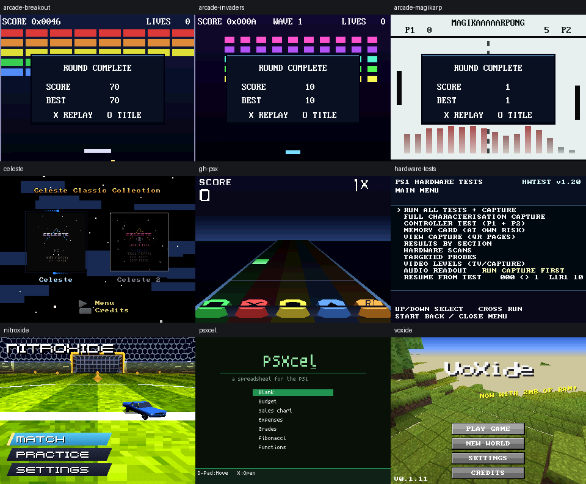
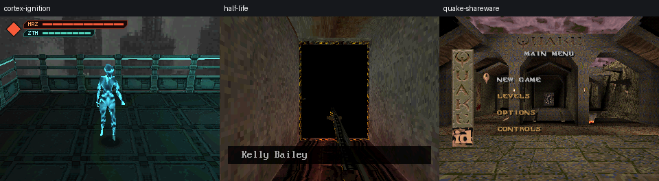
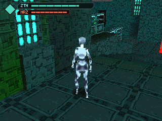

# Comicon first look, 4 September 2026

First-pass source and built-disc review, focused on Cortex Ignition 0.5. No game code, pins, or disc images changed during this review.

## What was actually reviewed

- PSoXide workspace: clean `main` at `0b4e58b2` when reviewed.
- Demo-disc repository: `ed557f3`.
- Cortex and shared runtime disc pins: `76d344bcb2344aad36a4fb7fcb217b13d755e583`.
- At review time the music branch was two commits ahead of this workspace: `78250418` and `76d344bc`. The disc already included these changes. Before committing this report, a fetch confirmed both were already on `origin/main`, and this checkout was fast-forwarded to `76d344bc`. The source discrepancy is resolved.
- Combined candidate: `/Users/ebonura/Downloads/ps1 games/PSoXide Demo Disc HL.cue`, 308,132 sectors, approximately 68:28. Its release receipt verified against the current artifacts.
- Combined BIN SHA-256: `96b3f48493ffa299b3109e70925bdb4fbd4fa3c3f68f75a3cf20399c1b866344`.

The existing Graphify index provided entry points into CD-DA packaging. Fresh source, pinned project data, disc contents and new emulator runs provided the current-state evidence. Several older handoffs and READMEs are stale, including claims that Cortex uses 0.4, has one music track, or is a one-pedestal review stage.

## Project and disc map

PSoXide combines four Rust workspaces: the emulator, SDK, engine, and editor. The editor authors and cooks Cortex's scene, assets and UI; editor-playtest runs the cooked game on the PS1 engine. The separate demo-disc repository packs standalone game images or executables into a carousel, relocates their data and audio addressing, and chain-loads them through its high-memory loader.

| Included program | What it demonstrates | This pass |
| --- | --- | --- |
| Cortex Ignition 0.5 | Original third-person action game, stance combat, animated actors, BSP world, inventory and authored UI | Two combined-disc launches plus recorded gameplay route |
| Half-Life, HL pressing only | GoldSrc-style PS1 port, streamed assets, scripted scenes, audio | Two combined-disc launches; captured tram scene |
| VoXide | Voxel survival sandbox with world generation, mining and crafting | Boot/title smoke route |
| NitroXide | Car football with split-screen support | Boot/menu smoke route |
| Celeste Collection | Celeste Classic and Celeste 2 native PS1 ports | Collection selector smoke route, not both campaigns |
| PSXcel | Spreadsheet, formulas, charts and memory-card persistence | Sample-sheet selector smoke route |
| GH-PSX | Five-fret rhythm prototype using a CD-anchored song clock | Gameplay boot and CD-DA route |
| PSoXide Arcade | Breakout, Space Invaders, Magikarp Pong | All three inner games launched and reached round-complete screens |
| Hardware Tests 1.20 | Hardware characterization and regression suite | Menu boot, including two deterministic launches; suite not executed |
| Quake shareware | Native PS1 shareware port with streaming world data | Two combined-disc launches to main menu |

The HL disc has ten programs plus Credits. The standard variant omits Half-Life. The tested HL table exposes Cortex directly, with no hidden flag.

## Cortex 0.5

This is the continuing 0.4 gameplay map with revised texture artwork and music. Current project data contains Aletha, three Custodians, one Heavy Enemy, and eight points of interest. The carried-over work includes Horizon/Zenith vitality, stance-colored targeting, directional evade buffering, attack hit windows, English/Italian text, item pickups and socketing.

In the captured gameplay the bright player and cyan/teal world accents remain easy to distinguish. The core presentation question for a short booth session is whether a new player understands the two enemy vitality pools and when to switch stance. The tutorial data covers inputs and resting-pool recovery, but the earlier tutorial audit identifies the offensive stance rule as insufficiently explained. This is an onboarding follow-up, not a conclusion from observing a new player.

### Music evidence

- `menu2.wav`: stereo 16-bit PCM, 44.1 kHz, 59.129 seconds. Authored on Main Menu, Settings and Credits.
- `cortex_boss.wav`: same format, 77.091 seconds. Authored as a combat-triggered HUD node at volume 80, scaled by music option 3.
- Standalone Cortex tracks: combat 2, menu 3. Combined HL tracks: combat 6, menu 7.
- Both tracks' complete PCM payloads match their source WAVs exactly in both the standalone and combined images. The standalone cue carries explicit two-second audio pregaps.
- Replayed the tracked 0.4 whole-level input tape against the existing 0.5 build, stopping at poll 5250. It completed with gameplay visible, no panic in the log, menu Play 3, `combat music:on`, combat Play 2, then `combat music:off` and Pause.
- The last data ReadN occurred at cycle 435,542,498. Combat Play occurred at cycle 1,329,604,840; no subsequent ReadN/ReadS appeared. This route therefore shows no data-read contention while combat music played.
- This checks packing and playback commands. It does not certify audible transitions, looping, seek timing or sound quality on the console.

### Confirmed music issue

`CddaPlayer::tick_fade` in the pinned `engine/crates/psx-engine/src/game_app.rs`, around line 397, rounds every nonzero volume increment up to a whole percentage point. As a result duration depends on volume, rather than following the requested tick count.

A standalone Rust probe executed the exact extracted method:

| Fade | Requested ticks | Actual ticks to target |
| --- | ---: | ---: |
| 0 to 80 | 60 | 60 |
| 80 to 0 | 120 | 80 |
| 0 to 40 | 60 | 40 |
| 40 to 0 | 120 | 40 |

At 60 updates per second, the intended two-second full-volume fade reaches silence after about 1.33 seconds. At half music volume it takes about 0.67 seconds. A fractional accumulator or elapsed-time interpolation would preserve duration independently of the slider.

### Follow-up checks before a final candidate

1. Source synchronization is complete: this checkout now includes the combat-music commits already on `origin/main` and pinned by the disc. Preserve the existing pinned candidate until its replacement is verified.
2. Correct the fade calculation and exercise volume 0, 50 and 100, disengagement/re-engagement, and a full track loop.
3. Verify death/respawn and inventory/system-overlay transitions during combat. Source inspection shows the combat detector considers enemy state but does not immediately clear engagement on player death; neither death nor respawn resets it. This differs from the written music plan and was not exercised as a dedicated failure route here. Gameplay-state entry also releases CD audio, so overlay behavior deserves a direct check.
4. Run the resulting final image on the real console, especially the first combat seek, SFX/music balance and repeat engagement. Emulator passes cannot establish drive timing or real GPU pacing.

Given the deadline, these are bounded finishing tasks. This review provides no reason to begin a renderer rewrite or a new art pass.

## Validation boundary and evidence

- `release_receipt.py verify`: passed.
- `check_program_headless.py`: all nine routes passed.
- `check_release_chainloads.py`: Cortex, Half-Life, Hardware Tests and Quake passed two byte-identical route/CD/GPU/PC replays each. Cortex showed 467 sustained textured gameplay frames with 467 distinct display hashes.
- The recorded Cortex route completed at poll 5250 with final display hash `0x4c189cd26a599cdf`.
- No fresh build, console run, full hardware-test battery, campaign completion, save/load test or subjective audio listening was performed.

Compact logs, the fade reproducer and screenshots are retained beside this report. The fuller raw route logs remain under `/tmp/astra-psoxide-review-20260904`.
