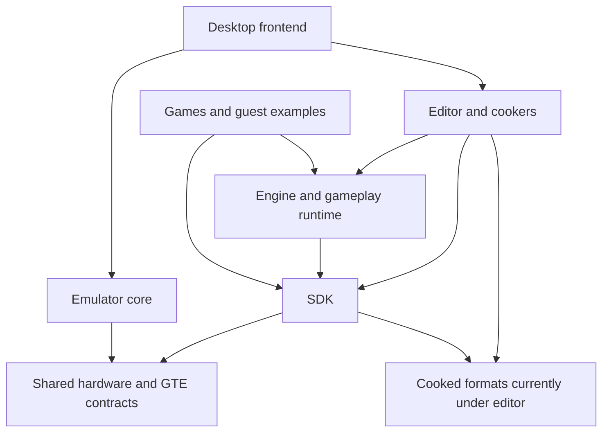

# Repository architecture

PSoXide currently contains a development stack and its integration fixtures.
A directory boundary is not yet an independently distributable package.

| Area | Role | Cargo workspace |
| --- | --- | --- |
| `sdk/` | 19 bare-metal crates, linker/runtime support and small PS1 examples | SDK |
| `engine/` | 5 crates for scenes, rendering, BSP, gameplay and data contracts; guest examples | Engine; examples have separate roots |
| `crates/` | Shared hardware definitions, disc formats and trace formats | Host |
| `editor/crates/` | 8 authoring, format and asset-cooking crates | Host |
| `emu/crates/` | 5 emulator, frontend, rendering, settings and validation crates | Host |
| `tools/` | 3 Rust build/development tools plus scripts | Host |
| `editor/projects/` | Authored games and project studies, including Cortex 0.4b | Data |
| `editor/archive/fixtures/` | Cook/replay fixtures and the New Project courtyard | Data |

The root [Cargo.toml](../Cargo.toml) lists host members. Device workspaces stay
separate because their target, linker and `build-std` configuration differ.

This is a conceptual dependency view, not a complete Cargo graph. In
particular, the frontend also directly depends on engine and SDK crates.

## Boundaries worth knowing

- `psx-asset` in the SDK reads layouts from
  [`psxed-format`](../editor/crates/psxed-format), a dependency-free `no_std`
  crate stored under `editor/`. This is a shared format contract, not editor UI.
- `psx-hw` lives under `crates/` and inherits root workspace metadata; SDK
  crates use it. The emulator also uses `psx-gte-core` from the SDK so hardware
  semantics are shared rather than copied.
- `frontend` defaults to its `editor` feature. `--no-default-features` removes
  the editor UI/project dependencies, but not all engine or format crates.
- [`psoxide-link`](../tools/psoxide-link/src/lib.rs) locates the source root
  through a fixed directory layout and checks `sdk/psoxide.ld`. Its hydration
  copies most source/content directories, not a standalone SDK package.
- Editor Play cooks a project and builds
  [`editor-playtest`](../engine/examples/editor-playtest). Extraction needs a
  versioned compiler/runtime contract as well as Rust dependency changes.

## Working in the repository

Use the [contributor guide](../CONTRIBUTING.md) for checks,
[downstream projects](downstream-projects.md) for SDK consumption, and the
[SDK separation proposal](sdk-separation.md) for a possible future layout.
The latter is a proposal; the current build still uses this repository.
