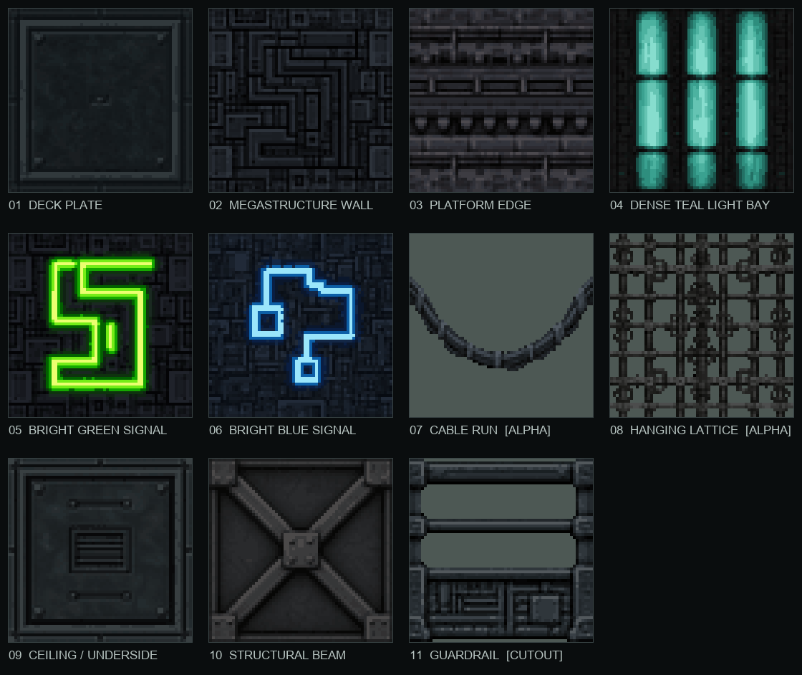

# DP City 64 x 64 Texture Kit

This is the compact construction set for rebuilding the supplied fog-city
mockups as a 3D BSP level. The initial set deliberately spent its eight slots on
large-scale architectural readability and the signature cyan/green/blue
accents, rather than on interchangeable micro-detail. Two structural surfaces
extend that set for complete floating-building shells, and an open guardrail
closes off playable edges without hiding the fog-city depth.



## Runtime contract

- Eleven textures, each exactly 64 x 64.
- 4bpp indexed PSXT, at most sixteen palette entries per texture.
- Opposite border pixels are reconciled and verified for seamless repetition.
- Per-role gamma and saturation grades lift the diffuse albedo before palette
  reduction; room lights can darken and shape it instead of rescuing crushed
  source blacks.
- Opaque materials use neutral PS1 modulation tint `(128, 128, 128)`.
- Cable, lattice, and guardrail reserve palette index zero for transparency and
  render from both sides. Cable and lattice use `Average` PS1 blending; the
  guardrail keeps its metal opaque and uses transparency only for its openings.
- Editable ImageGen masters remain in `source_assets/textures/dp_city_kit/masters/`.
- Deterministic runtime PNGs are in `source_assets/textures/dp_city_kit/final_64/`.
- Cooked textures are in `assets/textures/dp_city_kit/`.

## The eleven materials

| Material browser name | Intended BSP role |
| --- | --- |
| `DP City / Deck Plate` | One large recessed blue-black floor plate with a heavy shared frame and four fasteners. |
| `DP City / Megastructure Wall` | Clean non-emissive base matching the panel background of slots 04/05/06. |
| `DP City / Platform Edge` | Platform risers, bridge fascias, parapets and horizontal trim. |
| `DP City / Dense Teal Light Bay` | Three broad luminous wall slabs; repeat vertically or horizontally to form light banks. |
| `DP City / Bright Green Signal` | Large high-priority green wall marker. |
| `DP City / Bright Blue Signal` | Large high-priority cyan-blue wall marker. |
| `DP City / Cable Run (Average)` | Sagging cable cards stretched between buildings; transparent-zero and semi-transparent. |
| `DP City / Hanging Lattice (Average)` | Suspended gridwork, cages and service scaffolds on thin cards; transparent-zero and semi-transparent. |
| `DP City / Ceiling Underside` | One large framed service plate with a central vent for ceilings and floating-structure undersides. |
| `DP City / Structural Beam` | One full-tile X brace for broad horizontal or vertical support brushes. |
| `DP City / Guardrail (Cutout)` | Solid mechanical safety railing for playable-area boundaries; one horizontally repeating bay with transparent openings. |

The cable, lattice, and guardrail are cutout materials. Put them on thin brush
planes or image props instead of coating a solid wall. Their `Both` sidedness
makes each card readable from either direction. The guardrail is intended to
tile horizontally only; its top rail and armored kick plate deliberately differ.

## ImageGen prompt set

The assets were generated with the built-in ImageGen tool in its default mode,
using the supplied DP city screenshots as visual references. The shared prompt
contract was: square, front-facing orthographic texture; dark modular
industrial construction; PS1-era stepped/pixel-like detail; no perspective,
text, logos, border or vignette; visually compatible opposite edges; details
strong enough to survive 64 x 64 and sixteen colours.

The role-specific instructions were:

1. One unmistakable large recessed deck plate per tile: a broad central slab,
   one heavy perimeter frame, four corner fasteners and a small service latch,
   in medium-dark blue-black steel with restrained teal and copper wear.
2. A clean wall derived directly from the green-signal background by removing
   only its glyph and reconstructing the covered panels, preserving the module
   scale and blue-black rail language shared by slots 04/05/06.
3. Horizontal platform-edge bands, brackets, lips and underside teeth.
4. Exactly three broad, nearly continuous teal glass slabs, each roughly one
   fifth of the tile width, separated by narrow black structure and interrupted
   by only two retaining brackets.
5. One acid-green angular glyph filling roughly sixty percent of the tile,
   with a near-white core and saturated stepped halo.
6. One abstract cyan-blue broken-line glyph of comparable size and intensity,
   explicitly avoiding letters, numbers and recognisable icons; its background
   exposure is matched to the green panel and clean megastructure wall.
7. A broad U-shaped heavy cable bundle, edge-to-edge horizontally, isolated on
   real transparent RGBA with clamps and sparse secondary wires.
8. An edge-to-edge hanging industrial lattice of rails, rings, clamps, cages
   and a central conduit, isolated from its background for cutout use.
9. One large recessed underside plate related to the deck plate, with a heavy
   frame, four compact fasteners, a central vent and two short channels.
10. Exactly one structural X spanning nearly the full tile, with a compact
    central gusset and no separate machinery or trim bands above or below it.
11. One catwalk guardrail bay with two open rails, heavy shared posts and a
    greebled armored kick plate, restyled against the existing kit contact sheet
    and extracted on real transparent RGBA.

ImageGen supplied real alpha for the cable. The lattice generator painted its
transparency preview into RGB, so `build_kit.py` deterministically extracts the
dark framework and emits genuine binary alpha before quantisation.

## Rebuild

From the repository root:

```sh
python3 editor/projects/cortex-ignition-tech-demo-0.4/source_assets/textures/dp_city_kit/build_kit.py
cargo build --release -p psxed-tex --bin psxt-convert
```

Cook opaque sources without transparency:

```sh
target/release/psxt-convert source.png destination.psxt 64 64 4
```

Cook `dp_city_cable_run.png`, `dp_city_hanging_lattice.png`, and
`dp_city_guardrail.png` with:

```sh
target/release/psxt-convert source.png destination.psxt 64 64 4 --transparent-zero
```

`build_kit.py` also regenerates `dp_city_kit_contact.png` and the 3 x 3 repeat
check in `dp_city_kit_tileability.png`, then asserts dimensions, palette limits,
and exact opposite-edge continuity.
