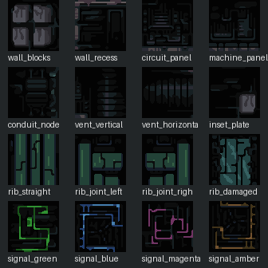

# DP atlas-derived BSP textures

This set translates the supplied `DP_Complete_v1.0.zip` pack into native
Cortex Ignition surface assets without repainting its pixel language.

The three `1. main platforms.png` sheets are true 32 x 32 grids:

| Set | Atlas size | Grid |
| --- | ---: | ---: |
| Set 1 | 1024 x 768 | 32 x 24 |
| Set 2 | 992 x 768 | 31 x 24 |
| Set 3 | 1024 x 1024 | 32 x 32 |

The extractor found 1,233 unique non-empty cells: 755 opaque and 478 with
alpha. Sixteen opaque cells were selected for the first BSP kit. Each selected
cell is present in three forms under
`source_assets/textures/dp_bsp_tiles/selected/`:

- `32/`: exact atlas pixels;
- `64_nearest/`: exact 2x nearest-neighbour enlargement;
- `64_scale2x/`: palette-preserving Scale2x/EPX enlargement.

The Scale2x version is the default because it tidies diagonal pixel stairs
without inventing colours or replacing the original drawing. The nearest
version remains available for a harder, chunkier comparison.



## Runtime assets

The sixteen files in `assets/textures/dp_bsp_tiles/` are cooked at exactly
64 x 64, 4bpp, with a 16-entry CLUT. They are opaque and do not reserve palette
index zero for transparency.

| Family | Textures | Suggested BSP use |
| --- | --- | --- |
| Dark fabric | `wall_blocks`, `wall_recess`, `circuit_panel`, `machine_panel` | Broad walls and secondary wall bays |
| Utility | `conduit_node`, `vent_vertical`, `vent_horizontal`, `inset_plate` | Floors, ceilings, service strips, and trim |
| Oxidised structure | `rib_straight`, `rib_joint_left`, `rib_joint_right`, `rib_damaged` | Pillars, buttresses, doorway frames, and load-bearing accents |
| Signals | `signal_green`, `signal_blue`, `signal_magenta`, `signal_amber` | Sparse route markers and machine focal points |

Keep the signals sparse. The source pack gets its mood from large fields of
near-black construction interrupted by small coloured marks, not from broadly
emissive walls. Use neutral material tint `(128, 128, 128)` and let fog and
vertex lighting establish depth.

## Rebuild

`source_assets/textures/dp_bsp_tiles/extract_tiles.py` slices and audits the
three main-platform atlases. It writes exact 32px tiles, nearest 64px tiles,
Scale2x 64px tiles, a JSON manifest, and comparison sheets.

```sh
python3 source_assets/textures/dp_bsp_tiles/extract_tiles.py \
  /path/to/unpacked/DP_Complete_v1.0 \
  /tmp/cortex-dp-tiles-audit

python3 source_assets/textures/dp_bsp_tiles/promote_selected.py \
  /tmp/cortex-dp-tiles-audit
```

`selected_tiles.json` records the source-cell hash and architectural role for
every promoted texture. The copied pack licence is preserved beside the
scripts as `public-license.txt`.

The assets are registered in `project.ron` as sixteen materials prefixed
`DP BSP /`. They intentionally remain unassigned so the 0.5 snapshot preserves
the inherited level geometry; paint them onto BSP faces from the material
browser.
